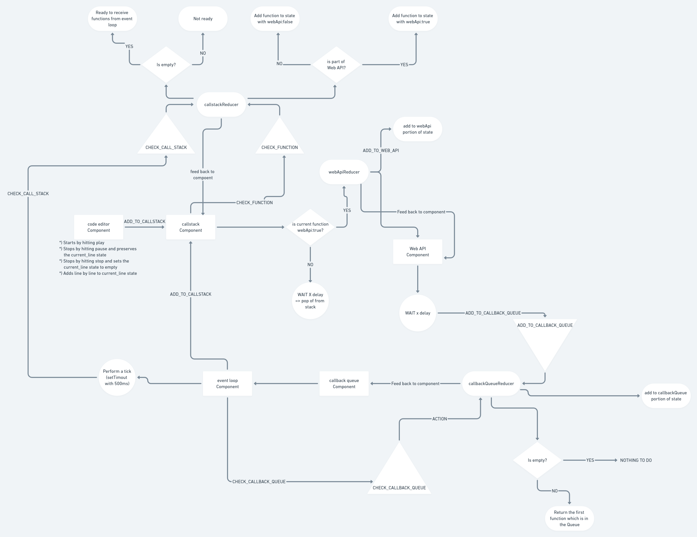

# Master The Event Loop

## TL;DR

#### [](https://github.com/r4pt0s/master_the_event_loop)

> _If you are a Javascript developer then you are already familiar with how Javascript works, right?_
> Well, it might not be the case. You are maybe writing Javascript code since years but still don't understand how the language works under the hood. You may have heard about terms such as "Call Stack, Callback Queue, Event Loop" but what's the deal with them?
> Did you ask yourself, _Why is that, that javascript executes my code not in order if I use a callback function with a settimeout with a delay of 0 right before the console.log?_
>
> If you are finding answers to the above questions then you found the right place. This project exactly addresses this fact & tries to explain this fundamental process visually and words.
>
> We are basically building a improved version of [this awesome project](http://latentflip.com/loupe/)
>
> [Production version](https://master-the-event-loop.netlify.com/) > [Current dev deployment](https://deploy-preview-32--master-the-event-loop.netlify.com/)

## Work on the project locally

In order to work and run the project locally you need NodeJs and npm installed on your system.
Perform the following steps:

```
 git clone https://github.com/Dhaval1403/master-the-event-loop.git

 cd master_the_event_loop

 npm install
 npm start
```

# Git Workflow

## Fork first 🍴

We use the fork approach for collaboration. Fork the repository first and sync it with the original repository.

### Steps to keep the local version up-to-date 🔄

#### Inital setup 🛫

- Clone your forked version
  `git clone <UrlToTheForKedVersion>`

- Update the remote Url in order to sync your fork with the original repo
  `git remote add upstream https://github.com/Dhaval1403/master-the-event-loop.git`
  or by using ssh
  `git remote add upstream git@github.com:Dhaval1403/master-the-event-loop.git`
- Verify that all urls are in place
  `git remote -v`
  this should give you a output like this
  ```
    origin  https://github.com/username/master-the-event-loop.git (fetch)
    origin  https://github.com/username/master-the-event-loop.git (push)
    upstream        https://github.com/Dhaval1403/master-the-event-loop.git (fetch)
    upstream        https://github.com/Dhaval1403/master-the-event-loop.git (push)
  ```

#### Keep the local repository up-to-date & change into dev branch 🔄

Before starting to work on the files

- Get the latest version of the dev branch
  `git pull upstream dev`
- Get the latest version of the master branch
  `git pull upstream master`
- Make sure that you made your changes always in the dev branch.
- Check in which branch you currently are
  `git branch`
  Then you will see something like this:
  ```
  * dev
  master
  ```
- If you are not in the dev branch switch to the dev branch
  `git checkout dev`
- Start hacking 💻

#### Keep the remote repository (forked version) up-to-date 🔄

- Get the latest version of the dev branch
  `git pull upstream dev`
- Get the latest version of the master branch
  `git pull upstream master`
- Push the new files to your forked version
  `git push origin dev`

#### Creating PRs 🆕

In order to tell us which changes you want to make in our project, push your changes to your fork to the **dev branch** and create a pull request to the original repository. This makes sure that we always have a working and stable master branch after we tested your changes.
If we made our tests and the **dev branch** is stable, we will merge the **dev branch** into the master branch without closing the **dev branch**.

In order to make a PR on Github, follow this steps:

- Add your files for staging with
  `git add .` for adding all files or
  `git add <path/to/filename>` for adding specific files
- Commit your changes
  `git commit -m "commit message"`
- Push your changes to the forked version
  `git push origin dev`
- Move over to your github page and click on "Make pull request"

## Goal 🏁

The goal of this project is, to show new developers what happen if they write javascript code which gets executed.

## Data flow diagram

In order to better understand the data flow of our app, we created this little diagram.


[Online version](https://whimsical.com/tkMQEQUTV5KpWkJVuD2wc)

## Who we are?

Our project team contains members from the [zero-to-mastery](https://zerotomastery.io) community.
Everything started with the Frosty February Hackathon 2020.

#### Project Lead

> [](https://github.com/r4pt0s) [](https://github.com/Dhaval1403) [](https://github.com/Meet1103)

#### Team Members and Contributers

> [](https://github.com/Avelansh) [](https://github.com/AkinAguda) [](https://github.com/gideonlexy) [](https://github.com/anaol) [](https://github.com/tubacatal) [](https://github.com/brainy099) [](https://github.com/faizhameed/) [](https://github.com/rahulzura)

This project was bootstrapped with [Create React App](https://github.com/facebook/create-react-app).
